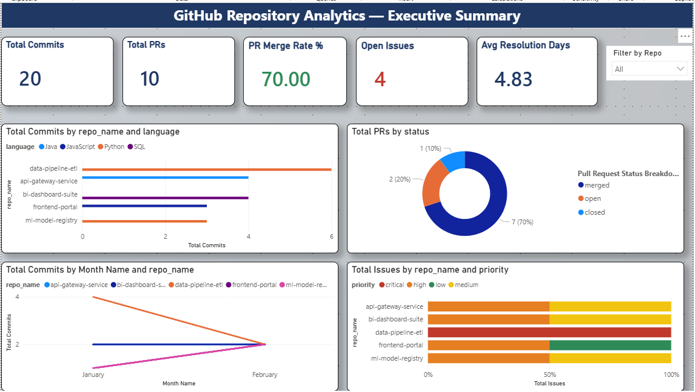
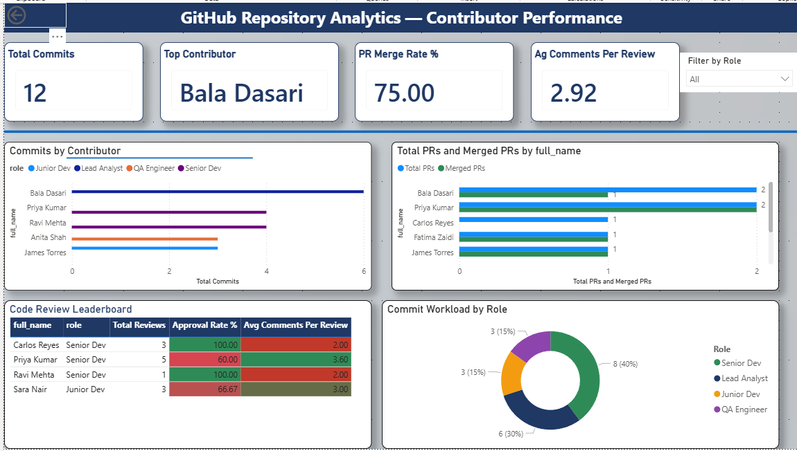

# GitHub Repository Analytics Dashboard

> A full end-to-end analytics solution analyzing software development 
> team activity across repositories — translating raw Git data into 
> actionable delivery, quality, and performance insights for engineering 
> leadership.


---

## The Business Problem

Engineering managers and delivery leads need visibility into:

- **How fast** is code being shipped across repositories?
- **Where are bottlenecks** in the PR review and merge process?
- **Are critical bugs** being resolved within SLA timeframes?
- **Who is contributing** the most and is workload balanced?
- **Is team velocity** increasing or decreasing month over month?

Without a centralized analytics layer, this data is scattered across 
GitHub activity logs, making it impossible to surface in sprint reviews 
or stakeholder reports.

---

## Solution Overview

A two-page interactive Power BI dashboard built on a SQL Server star 
schema, with 18 DAX measures covering commit velocity, PR cycle time, 
issue SLA tracking, and contributor performance.

---

## Tech Stack

| Tool | Purpose |
|---|---|
| SQL Server (SSMS) | Relational data modeling and querying |
| Power BI Desktop | Dashboard design and visualization |
| DAX | Business KPI measures and time intelligence |
| Star Schema | Data model design pattern |
| Git / GitHub | Version control and portfolio publishing |

---

## Data Model — Star Schema

6 tables with 8 relationships:

```
repositories ──── commits ──── contributors
      │                              │
      └──── pull_requests ───────────┤
      │           │                  │
      └──── issues│            code_reviews
                  └────────────────────┘
```

| Table | Rows | Type |
|---|---|---|
| repositories | 5 | Dimension |
| contributors | 10 | Dimension |
| commits | 20 | Fact |
| pull_requests | 10 | Fact |
| issues | 10 | Fact |
| code_reviews | 12 | Fact |

---

## DAX Measures (18 Total)

### Commit Metrics
- `Total Commits` — COUNTROWS of commits table
- `Total Lines Added` — SUM of lines added across all commits
- `Net Lines of Code` — Lines added minus lines deleted
- `Commits Per Contributor` — DIVIDE with zero-safe handling

### Pull Request Metrics
- `Total PRs` — Total pull request count
- `Merged PRs` — CALCULATE with merged status filter
- `PR Merge Rate %` — Percentage of PRs successfully merged
- `Avg PR Cycle Time (hrs)` — AVERAGEX hours from creation to merge

### Issue Metrics
- `Total Issues` — Total issue count
- `Open Issues` — CALCULATE filtering open and in_progress status
- `Issue Resolution Rate %` — Closed issues as percentage of total
- `Avg Resolution Days` — AVERAGEX days from creation to close

### Code Review Metrics
- `Total Reviews` — Total code review count
- `Approval Rate %` — Approved reviews as percentage of total
- `Avg Comments Per Review` — DIVIDE total comments by review count

### Contributor Metrics
- `Most Active Contributor` — TOPN contributor by commit count
- `Contributors With No PRs` — FILTER contributors with zero PRs

### Time Intelligence
- `Commits MoM Change %` — Month over month velocity using DATEADD

---

## Dashboard Pages

### Page 1 — Executive Summary


**Visuals:**
- 5 KPI cards → Total Commits, Total PRs, PR Merge Rate, 
  Open Issues, Avg Resolution Days
- Commits by Repository → Horizontal bar chart by language
- PR Status Breakdown → Donut chart (merged/open/closed)
- Monthly Commit Trend → Line chart Jan→Feb 2024 by repo
- Issues by Priority → Stacked bar chart (critical/high/medium/low)
- Filter by Repo → Dropdown slicer

**Key Insights:**
- data-pipeline-etl is the most active repo with 6 commits
- 70% PR merge rate indicates a healthy delivery pipeline
- api-gateway-service has the highest open issue count — risk flag
- ml-model-registry shows fastest commit growth trend

---

### Page 2 — Contributor Performance


**Visuals:**
- 4 KPI cards → Total Reviews, Top Contributor, 
  Approval Rate, Avg Comments Per Review
- Commits by Contributor → Bar chart ranked by volume
- PRs Raised vs Merged → Clustered bar gap analysis
- Code Review Leaderboard → Table with conditional formatting
- Commit Workload by Role → Donut chart by seniority level
- Filter by Role → Dropdown slicer

**Key Insights:**
- Bala Dasari is top contributor across commits and reviews
- Senior Devs carry 40% of total commit workload
- Priya Kumar has highest PRs raised with 100% merge rate
- Approval rate of 75% with avg 2.92 comments per review

---

## SQL Scripts

### 01_create_tables.sql
Creates all 6 tables with primary and foreign key constraints
in a GitHubAnalytics database on SQL Server.

### 02_insert_data.sql
Inserts realistic sample data across all tables covering
January and February 2024 activity.

### 03_practice_queries.sql
8 analytical SQL queries covering:
- Commits per contributor with role breakdown
- PR merge rate by repository
- Issue resolution time by priority
- Code review approval rate per reviewer
- Monthly commit trend analysis
- Open issue risk flagging
- PR cycle time by repository
- Contributor leaderboard across all activity types

---

## How to Run

### SQL Setup
```sql
-- 1. Open SSMS and connect to your SQL Server instance
-- 2. Run scripts in order:
--    01_create_tables.sql
--    02_insert_data.sql
--    03_practice_queries.sql
```

### Power BI Setup
1. Open `dashboard/GitHub_Analytics_Dashboard.pbix`
2. Click **Home** → **Transform Data** → update source path
3. Load CSVs from `/data` folder if not using SQL Server directly
4. Click **Refresh** to load data
5. Navigate between pages using the arrow buttons

---

## Business Relevance

This project mirrors operational analytics dashboards delivered in 
enterprise environments:

- **Purolator** — Smart Sort operational monitoring dashboard
- **Canada Post** — CIAM platform KPI and incident reporting

The same patterns apply — star schema modeling, DAX business measures,
and executive-facing visualizations built for self-service consumption.

---

## License
MIT